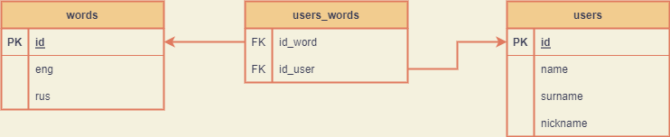

# Курсовая работа «ТГ-чат-бот «Обучалка английскому языку»» по курсу «Базы данных»

Схема представлена на рисунке

1. Пароль к postgresSQL, название базы данных, token пользователя Telegram-бота
вставляем в соответствующие строки ***password***, ***name_bd***, ***token***
в файл [password.ini](password.ini). Делается это для того, чтобы эти данные
автоматически вставлялись в функции, где это требуется.

2. Запускаем файл [create_bd.py](create_bd.py). При этом создается база данных.
Создаются таблицы ***words***, ***users***, ***users_words***. Далее эти таблицы наполняются
начальным списком 15 пар слов: слово на английском языке - его перевод на русском языке.
При повторном запуске база данных удаляется и создается заново. Такая возможность
добавлена для полной очистки БД от данных, записанных в процессе выполнения программы:
Слова, добавленные пользователями и данные о пользователях.

3. Запускаем файл [main.py](main.py). При этом начинается выполнение основной
программы.
4. Запускаем Telegram-бота командой "/start". Добавлена возможность запуска командой "/s"
для краткости.
5. Далее отвечаем на вопрос перевести слово на русском языке нажатием на соответствующую 
кнопку с ответом. При неверном ответе предлагается ответить еще раз. После правильного ответа 
предлагается перевести следующее слово.
6. Нажатием на кнопку "ДАЛЕЕ" можно перейти к следующему слову на русском языке,
которое нужно перевести.
7. Нажатием на кнопку "ДОБАВИТЬ СЛОВО" переходим в добавлению в таблицу
своей пары слов: слово на английском языке - его перевод на русском языке. 
Вставлять слова необходимо через пробел. ВАЖНО: добавить можно слова,
которые отсутствуют в базе данных. Если такое слово уже есть в базе 
данных, оно не добавится повторно.
8. Нажатием на кнопку "УДАЛИТЬ СЛОВО" переходим к удалению из таблицы
пары слов: слово на английском языке - его перевод на русском языке.
Для этого вставляем удаляемое слово на русском или английском языке.
ВАЖНО: пользователь может удалить только те пары слов, которые добавил сам.

## Состав проекта

* [main.py](main.py) - основной файл работы Telegram-бота.
* [create_bd.py](create_bd.py) - файл создания базы данных
и наполнения первоначальным списком слов.
* [work_bd.py](work_bd.py) - файл с функциями, работающими с 
базой данных.
* [password.ini](password.ini) - файл для упрощенной работы
с паролем, названием БД и токеном.
* coursework_sqlpy.png - файл со схемой таблиц БД.
* [requirements.txt](requirements.txt) - файл с зависимостями.
* [README.md](README.md) - файл с описанием работы.

